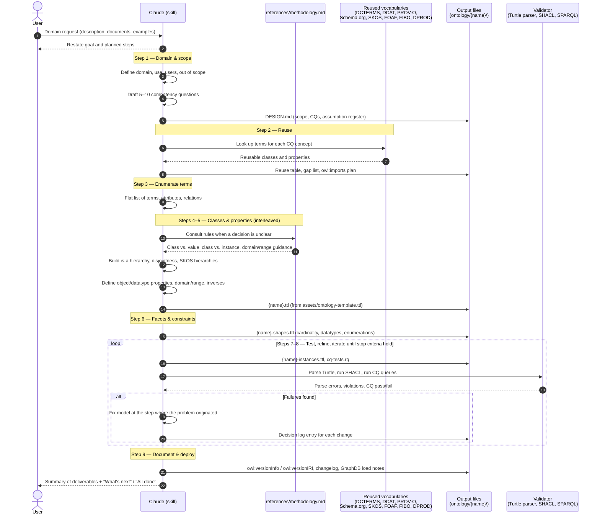

# Graphwise Ontology Engineer — action sequence

The order of actions the skill performs from the user's request to the validated
deliverables. Steps 7 and 8 loop until the stop criteria hold.

```mermaid
sequenceDiagram
    autonumber
    actor U as User
    participant C as Claude (skill)
    participant M as references/methodology.md
    participant V as Reused vocabularies<br/>(DCTERMS, DCAT, PROV-O,<br/>Schema.org, SKOS, FOAF, FIBO, DPROD)
    participant F as Output files<br/>(ontology/{name}/)
    participant T as Validator<br/>(Turtle parser, SHACL, SPARQL)

    U->>C: Domain request (description, documents, examples)
    C-->>U: Restate goal and planned steps

    Note over C: Step 1 — Domain & scope
    C->>C: Define domain, use, users, out of scope
    C->>C: Draft 5–10 competency questions
    C->>F: DESIGN.md (scope, CQs, assumption register)

    Note over C,V: Step 2 — Reuse
    C->>V: Look up terms for each CQ concept
    V-->>C: Reusable classes and properties
    C->>F: Reuse table, gap list, owl:imports plan

    Note over C: Step 3 — Enumerate terms
    C->>C: Flat list of terms, attributes, relations

    Note over C,M: Steps 4–5 — Classes & properties (interleaved)
    C->>M: Consult rules when a decision is unclear
    M-->>C: Class vs. value, class vs. instance, domain/range guidance
    C->>C: Build is-a hierarchy, disjointness, SKOS hierarchies
    C->>C: Define object/datatype properties, domain/range, inverses
    C->>F: {name}.ttl (from assets/ontology-template.ttl)

    Note over C: Step 6 — Facets & constraints
    C->>F: {name}-shapes.ttl (cardinality, datatypes, enumerations)

    loop Steps 7–8 — Test, refine, iterate until stop criteria hold
        C->>F: {name}-instances.ttl, cq-tests.rq
        C->>T: Parse Turtle, run SHACL, run CQ queries
        T-->>C: Parse errors, violations, CQ pass/fail
        alt Failures found
            C->>C: Fix model at the step where the problem originated
            C->>F: Decision log entry for each change
        end
    end

    Note over C: Step 9 — Document & deploy
    C->>F: owl:versionInfo / owl:versionIRI, changelog, GraphDB load notes
    C-->>U: Summary of deliverables + "What's next" / "All done"
```
